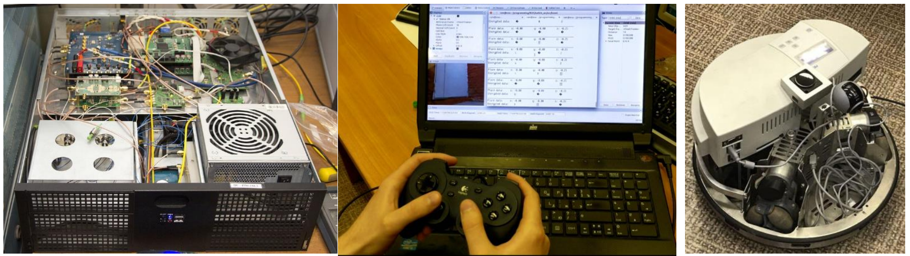

## Quantum key distribution implementation for mobile robots

[Project description](docs/Description_SCWQKD-Robots.pdf)

## Dependencies
First of all, install crypto++ library. For ubuntu just use the repositories:

    $ sudo apt-get install libcrypto++-dev libcrypto++-doc libcrypto++-utils

    $ g++ yourtest.cpp -o yourtest -I/opt/ros/indigo/include -L/opt/ros/indigo/lib -Wl,-rpath,/opt/ros/indigo/lib -lroscpp -lrosconsole -lrostime -lroscpp_serialization -lboost_system -lboost_thread -pthread -lactionlib
